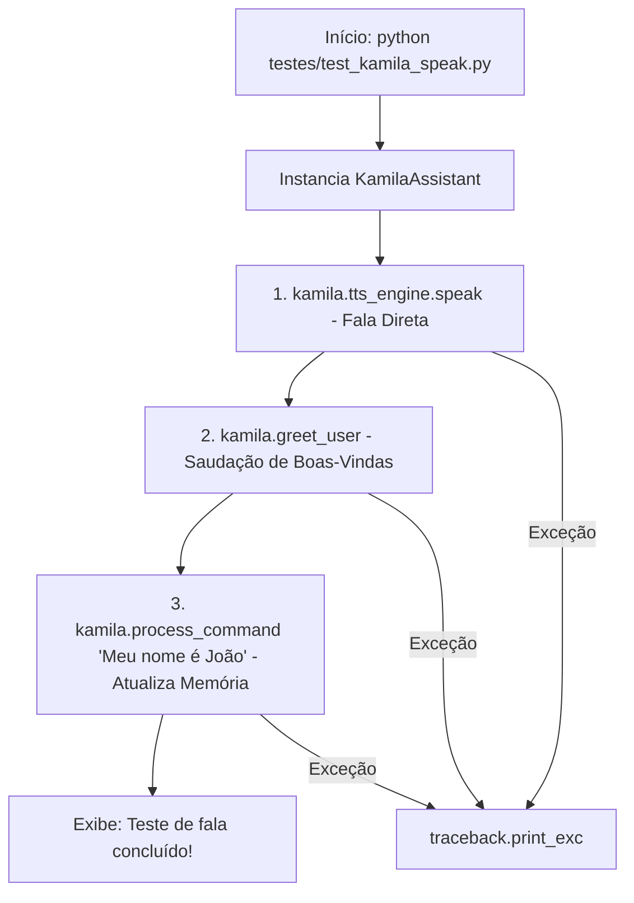

# Documentação Técnica: Teste Direto de Fala e Ações (`testes/test_kamila_speak.py`)

Esta documentação descreve o funcionamento do script de teste **`test_kamila_speak.py`**, localizado em `testes/test_kamila_speak.py`. Este módulo realiza a **validação da saída de voz e do processamento direto de comandos**, sem necessitar de acionamento por microfone ou palavra de ativação (*wake word*).

---

## 1. Visão Geral da Arquitetura do Teste

O `test_kamila_speak.py` instancia a assistente `KamilaAssistant` (`.kamila/main.py`) e executa 3 chamadas diretas de métodos para confirmar que a saída de áudio e as atualizações do banco de memória estão funcionando.



---

## 2. Passo a Passo dos Testes Executados

### 2.1 Teste de Síntese de Voz Nativa
```python
kamila.tts_engine.speak("Olá! Eu sou a Kamila e estou funcionando!")
```
Verifica se o motor `TTSEngine` consegue encadear a fila de síntese nativa do sistema operacional (`pyttsx3`).

---

### 2.2 Teste de Saudação Contextualizada
```python
kamila.greet_user()
```
Executa a rotina da assistente que consulta a hora atual e o nome do usuário no banco `data/memory.json`, gerando a resposta de boas-vindas adequada (ex: *"Bom dia, João!"*).

---

### 2.3 Teste de Processamento NLU e Atualização de Perfil
```python
kamila.process_command("Meu nome é João")
```
Alimenta o fluxo NLU com a frase de identificação pessoal, testando se a ação `set_user_name` é disparada e gravada no arquivo de memória.

---

## 3. Como Executar

No terminal:

```bash
python testes/test_kamila_speak.py
```
