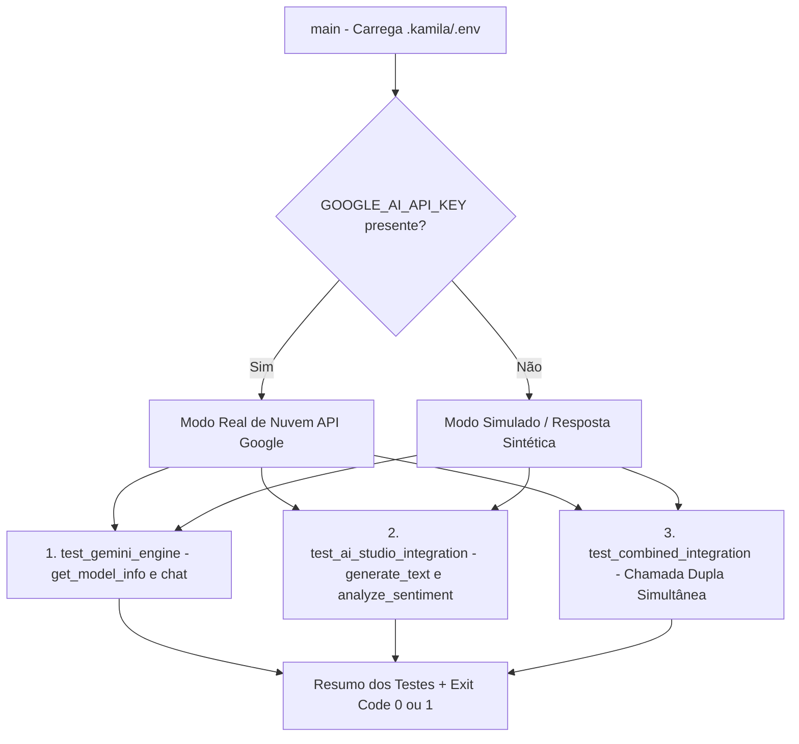

# Documentação Técnica: Suíte de Testes dos Módulos LLM (`testes/test_llm_modules.py`)

Esta documentação descreve as especificações e o funcionamento do script **`test_llm_modules.py`**, localizado em `testes/test_llm_modules.py`. Este módulo realiza a **validação funcional das integrações de inteligência artificial generativa** baseadas no Google Gemini e no Google AI Studio.

---

## 1. Visão Geral da Suíte de Testes

O `test_llm_modules.py` testa a conectividade, a geração de texto conversacional e a análise de sentimento fornecidas pelas classes em `.kamila/llm/`.



---

## 2. Detalhamento das 3 Etapas de Teste

### 2.1 `test_gemini_engine()`
- **Obtenção de Metadados**: Chama `gemini.get_model_info()` para retornar a versão do modelo ativado.
- **Teste de Diálogo**: Envia a sequência de mensagens (*"Olá! Como você está?"*, *"Que horas são?"*, *"Conta uma piada"*, *"Obrigado pela ajuda!"*) e imprime os primeiros 100 caracteres de resposta.

---

### 2.2 `test_ai_studio_integration()`
- **Lista de Modelos**: Chama `ai_studio.get_available_models()`.
- **Geração de Texto**: Envia prompts de teste e valida o retorno.
- **Análise de Sentimento**: Envia a frase *"Estou muito feliz hoje!"* para o método `ai_studio.analyze_sentiment()`, validando o rótulo retornado (ex: `"positivo"`).

---

### 2.3 `test_combined_integration()`
- Instancia simultaneamente `GeminiEngine` e `AIStudioIntegration`.
- Dispara uma pergunta de teste em ambos os motores em paralelo para verificar a coexistência de instâncias de modelo em memória sem conflitos de sessão.

---

## 3. Como Executar

No terminal:

```bash
python testes/test_llm_modules.py
```
