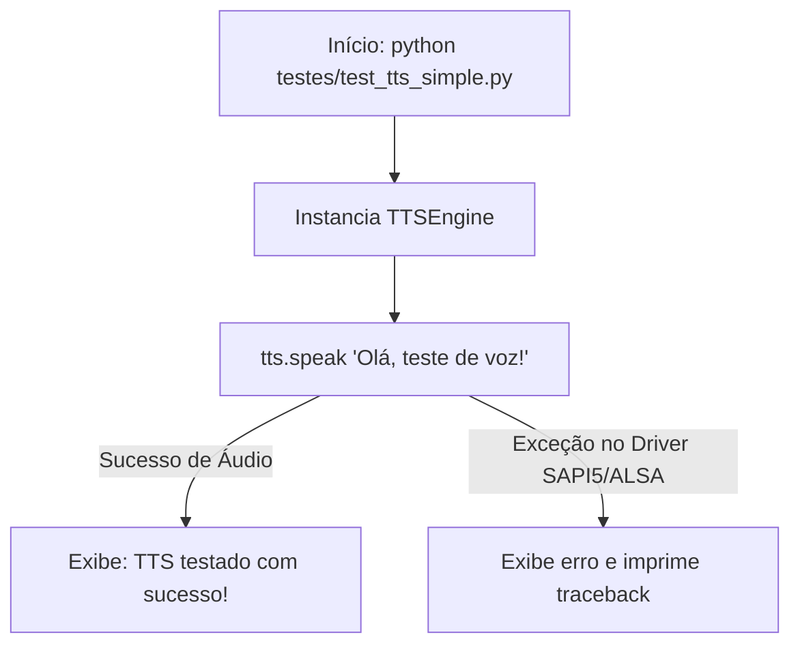

# Documentação Técnica: Teste Simplificado do Motor de Fala (`testes/test_tts_simple.py`)

Esta documentação descreve o funcionamento do script de teste **`test_tts_simple.py`**, localizado em `testes/test_tts_simple.py`. Este módulo é um **teste de fumaça (*smoke test*) minimalista** projetado para isolar e verificar o motor de síntese de voz (`TTSEngine`).

---

## 1. Visão Geral do Código (`test_tts_simple.py`)

O `test_tts_simple.py` adiciona o caminho dos pacotes core da assistente, inicializa o `TTSEngine` e envia um único comando de síntese de voz nativa.



---

## 2. Código-Fonte Completo

```python
#!/usr/bin/env python3
"""
Teste simples do TTS Engine
"""

import sys
import os

# Adicionar o diretório .kamila ao path
sys.path.insert(0, os.path.join(os.path.dirname(__file__), '.kamila'))

try:
    from core.tts_engine import TTSEngine

    print("Testando TTS Engine...")

    # Inicializar TTS
    tts = TTSEngine()

    # Testar fala
    print("Falando: 'Olá, teste de voz!'")
    tts.speak("Olá, teste de voz!")

    print("TTS testado com sucesso!")

except Exception as e:
    print(f"Erro no teste TTS: {e}")
    import traceback
    traceback.print_exc()
```

---

## 3. Como Executar

No terminal:

```bash
python testes/test_tts_simple.py
```
