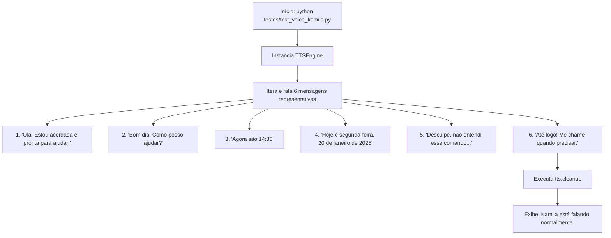

# Documentação Técnica: Teste Sequencial de Voz e Expressividade (`testes/test_voice_kamila.py`)

Esta documentação descreve as especificações do script de teste **`test_voice_kamila.py`**, localizado em `testes/test_voice_kamila.py`. Este módulo realiza um **teste auditivo sequencial das saídas de fala da Kamila**, validando o timbre, a cadência e a inicialização do motor de síntese `TTSEngine`.

---

## 1. Visão Geral do Teste

O `test_voice_kamila.py` submete o sintetizador de voz a 6 frases representativas de diferentes interações cotidianas da assistente:



---

## 2. Passo a Passo do Código (`test_voice_kamila.py`)

### 2.1 Enfileiramento e Execução de Mensagens
```python
test_messages = [
    "Olá! Estou acordada e pronta para ajudar!",
    "Bom dia! Como posso ajudar?",
    "Agora são 14:30",
    "Hoje é segunda-feira, 20 de janeiro de 2025",
    "Desculpe, não entendi esse comando. Pode repetir?",
    "Até logo! Me chame quando precisar."
]

for message in test_messages:
    tts.speak(message)
```

---

### 2.2 Desalocação do Driver (`cleanup`)
Ao concluir a sequência, o método `tts.cleanup()` é chamado para encerrar a thread em segundo plano e desalocar a instância do motor nativo SAPI5/ALSA.

---

## 3. Como Executar

No terminal:

```bash
python testes/test_voice_kamila.py
```
