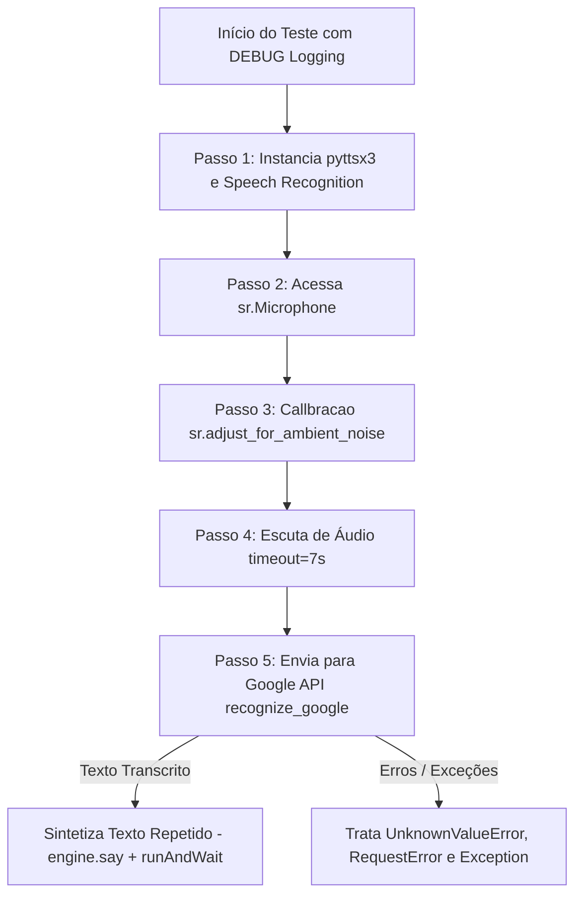

# Documentação Técnica: Script de Diagnóstico de Fala com Telemetria (`src/teste_com_log.py`)

Esta documentação descreve o funcionamento e a arquitetura do script Python **`teste_com_log.py`**, localizado em `src/teste_com_log.py`. Este módulo é uma **ferramenta de diagnóstico detalhada** que rastreia passo a passo o ciclo completo de escuta, calibração de ruído ambiente, transcrição no Google Speech Recognition e síntese de resposta com `pyttsx3`.

---

## 1. Visão Geral da Arquitetura do Teste

O `teste_com_log.py` configura o registrador nativo em nível `DEBUG` (`logging.basicConfig(level=logging.DEBUG)`), exibindo carimbos de data/hora para cada micro-etapa do pipeline.

---

## 2. Passo a Passo do Código (`teste_com_log.py`)

### 2.1 Inicialização e Nível `DEBUG` (Linhas 6 a 18)
- Define `logging.basicConfig(level=logging.DEBUG, format='%(asctime)s - %(levelname)s - %(message)s')`.
- Instancia a voz nativa SAPI5/ALSA com velocidade de fala ajustada (`engine.setProperty('rate', 180)`).
- Instancia o reconhecedor de fala `r = sr.Recognizer()`.

---

### 2.2 Calibração do Microfone e Captura (Linhas 20 a 33)
- Abre o microfone padrão `with sr.Microphone() as source:`.
- Executa a amostragem do ruído de fundo `r.adjust_for_ambient_noise(source)` para evitar acionamento falso por estática.
- Captura o bloco de áudio com tempo limite de 7 segundos (`r.listen(source, timeout=7)`).

---

### 2.3 Transcrição e Síntese de Resposta (Linhas 35 a 46)
- Envia o buffer gravado para `r.recognize_google(audio, language='pt-BR')`.
- Exibe o texto compreendido no terminal.
- Re-sintetiza a frase transcrita por voz através de `engine.say(texto)` seguido por `engine.runAndWait()`.

---

### 2.4 Tratamento de Erros e Exceções (Linhas 48 a 55)
- **`sr.UnknownValueError`**: Captura áudio inaudível ou ruído não transformável em texto.
- **`sr.RequestError`**: Captura falha de conexão de rede com a API do Google Speech.
- **`Exception`**: Exibe o traceback completo via `logging.error(..., exc_info=True)` para identificar conflitos com o servidor de som PulseAudio/ALSA.
