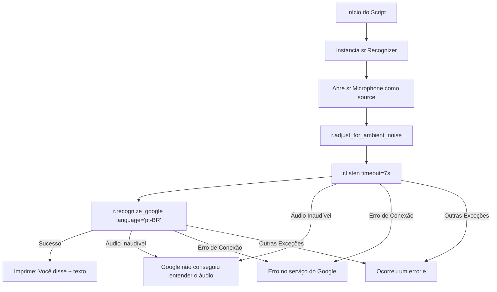

# Documentação Técnica: Script Simplificado de Teste de Microfone (`src/teste_microfone.py`)

Esta documentação descreve o funcionamento do script Python **`teste_microfone.py`**, localizado em `src/teste_microfone.py`. Este módulo é um **script minimalista de teste de bancada (*smoke test*)**, utilizado para verificar rapidamente a integridade do microfone físico e a conectividade com o serviço de transcrição Google Speech Recognition.

---

## 1. Visão Geral do Código (`teste_microfone.py`)

```python
import speech_recognition as sr

r = sr.Recognizer()
with sr.Microphone() as source:
    print("Ajustando para o ruído...")
    r.adjust_for_ambient_noise(source)
    print("Diga alguma coisa!")
    try:
        audio = r.listen(source, timeout=7)
        print("Reconhecendo...")
        texto = r.recognize_google(audio, language='pt-BR')
        print("Você disse: " + texto)
    except sr.UnknownValueError:
        print("Google não conseguiu entender o áudio")
    except sr.RequestError as e:
        print(f"Erro no serviço do Google; {e}")
    except Exception as e:
        print(f"Ocorreu um erro: {e}")
```

---

## 2. Fluxo de Execução



---

## 3. Principais Aplicações

1. **Validação Rápida de Hardware**: Utilizado antes de iniciar a assistente completa para confirmar se o sistema operacional reconheceu o microfone correto.
2. **Diagnóstico de Permissões de Som**: Útil para testar se o processo Python possui permissão de acesso aos dispositivos de mídia no Windows ou PulseAudio/ALSA no Linux.
