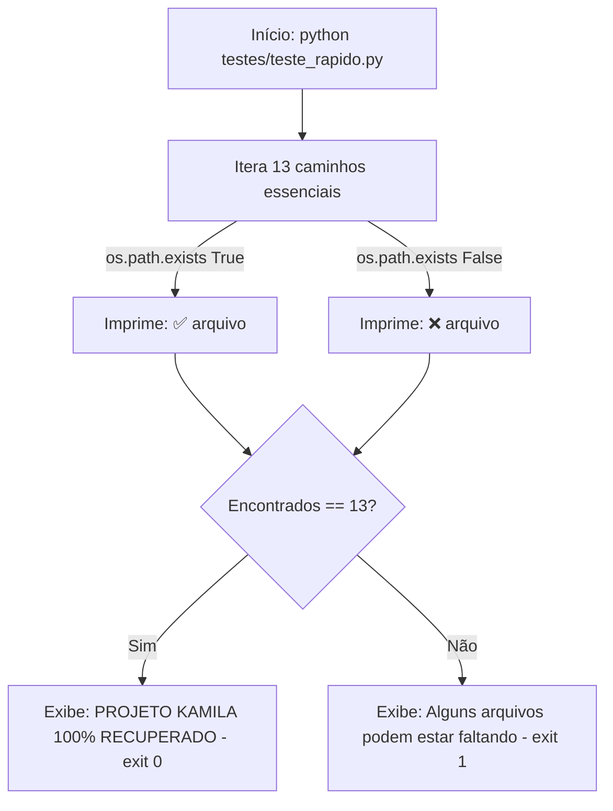

# Documentação Técnica: Teste Ultra-Rápido de Arquivos Essenciais (`testes/teste_rapido.py`)

Esta documentação descreve as especificações do script **`teste_rapido.py`**, localizado no diretório `testes/teste_rapido.py`. Este módulo fornece uma **verificação ultra-rápida sem dependências externas (*Smoke Test de Arquivos*)**, avaliando a presença física dos 13 arquivos vitais da assistente em milissegundos.

---

## 1. Visão Geral da Arquitetura do Teste

O `teste_rapido.py` utiliza exclusivamente a biblioteca padrão `os` para validar se nenhum arquivo essencial do ecossistema foi renomeado, movido ou excluído.



---

## 2. Relação dos 13 Arquivos Verificados

1. `.kamila/main.py`
2. `.kamila/main_with_llm.py`
3. `.kamila/core/stt_engine.py`
4. `.kamila/core/tts_engine.py`
5. `.kamila/core/interpreter.py`
6. `.kamila/core/memory_manager.py`
7. `.kamila/core/actions.py`
8. `.kamila/llm/gemini_engine.py`
9. `.kamila/llm/ai_studio_integration.py`
10. `testes/test_llm_modules.py`
11. `config/requirements.txt`
12. `data/memory.json`
13. `docs/README.md`

---

## 3. Como Executar

No terminal:

```bash
python testes/teste_rapido.py
```
