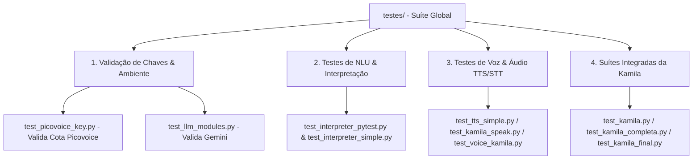

# Documentação Técnica: Suíte Global de Testes (`testes/`)

Esta documentação descreve em detalhes a estrutura, os módulos e a utilidade do diretório **`testes/`**, localizado na raiz do projeto `testes/`. Este diretório centraliza a **suíte de testes unitários, testes de integração, testes de regressão e utilitários de validação de chaves de API** da assistente **Kamila**.

---

## 1. Visão Geral da Arquitetura de Testes

O diretório `testes/` organiza a validação da assistente em 4 pilares principais:



---

## 2. Relação e Descrição de Todos os Arquivos

| Arquivo / Módulo | Categoria | Descrição / Função no Sistema |
| :--- | :--- | :--- |
| **`test_picovoice_key.py`** | Validação de Chave | Testa a conexão com o Picovoice Console para confirmar se a `PICOVOICE_API_KEY` do `.env` é válida. |
| **`test_interpreter_pytest.py`**| NLU / Pytest | Teste de unidade estruturado para o framework `pytest`, validando o dicionário de intenções do `CommandInterpreter`. |
| **`test_interpreter_simple.py`**| NLU | Versão simplificada de teste de bancada para a classificação de comandos. |
| **`test_kamila.py`** | Integração | Suíte principal de integração que testa inicialização de motores, `.env` e estruturas de pasta. |
| **`test_kamila_completa.py`**| Integração | Teste de ciclo de vida completo incluindo detecção de wake word e respostas simuladas. |
| **`test_kamila_corrigido.py`**| Integração | Ajuste de compatibilidade para execução sem dependência de microfone ativo. |
| **`test_kamila_final.py`** | Integração | Suíte de validação final pré-build/commit. |
| **`test_kamila_simples.py`** | Integração | Teste rápido de checagem da máquina de estados (`is_awake`). |
| **`test_kamila_init.py`** | Unidade | Valida a função `initialize_system()` do pacote raiz. |
| **`test_tts_simple.py`** | Áudio / TTS | Valida se o motor `pyttsx3` consegue emitir sons pelo sintetizador SAPI5/ALSA. |
| **`test_kamila_speak.py`** | Áudio / TTS | Testa o método `speak()` do `TTSEngine`. |
| **`test_voice_kamila.py`** | Áudio / STT | Testa o microfone e o reconhecimento de fala em ambiente de teste. |
| **`test_llm_modules.py`** | IA / LLM | Testa a conectividade REST e a geração de respostas do Google Gemini. |
| **`gemini_engine.py`** | Mock / Engine | Implementação isolada do motor Gemini utilizada pela suíte de testes. |
| **`teste_rapido.py`** | Smoke Test | Teste de fumaça para execução rápida antes de commits. |
| **`README.md`** | Documentação | Instruções de execução da suíte de testes. |
| **`README_ATUALIZADO.md`** | Documentação | Guia atualizado com instrução de cobertura de testes. |

---

## 3. Como Executar a Suíte de Testes

### 3.1 Executando com `pytest`
```bash
pytest testes/test_interpreter_pytest.py
```

### 3.2 Executando Testes Individuais
```bash
python testes/test_picovoice_key.py
python testes/test_kamila_final.py
```
