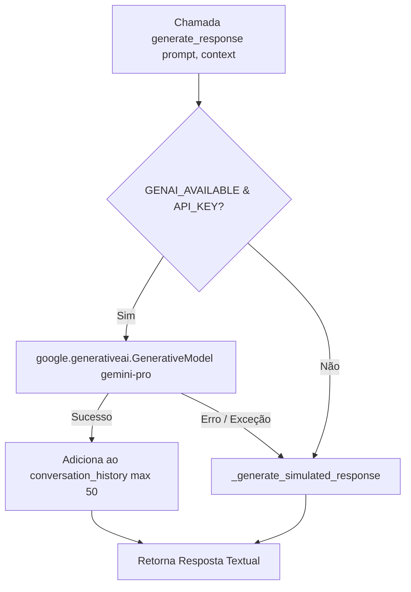

# Documentação Técnica: Motor Conversacional Gemini da Suíte de Testes (`testes/gemini_engine.py`)

Esta documentação descreve o funcionamento, a estrutura e a resiliência da classe **`GeminiEngine`**, localizada em `testes/gemini_engine.py`. Este módulo fornece a **camada de testes para inferência de linguagem natural**, contando com suporte a respostas em nuvem com o modelo `gemini-pro` e um **mecanismo de contingência (*fallback*) com respostas simuladas offline**.

---

## 1. Visão Geral da Arquitetura

O `testes/gemini_engine.py` foi projetado para garantir que os testes automatizados da assistente **Kamila** continuem passando mesmo sem conexão com a internet ou sem uma chave de API válida configurada.

---

## 2. Parâmetros de Geração e Segurança

O motor é configurado com as seguintes diretivas de geração:

- **`temperature=0.7`**: Equilíbrio ideal entre criatividade e coerência contextual.
- **`top_k=40`** & **`top_p=0.95`**: Filtragem de amostragem probabilística de tokens.
- **`max_output_tokens=2048`**: Limite máximo de tamanho por resposta gerada.
- **Filtros de Segurança (`safety_settings`)**: Bloqueio ativo no nível `BLOCK_MEDIUM_AND_ABOVE` para assédio, discurso de ódio, conteúdo sexualmente explícito e conteúdo perigoso.

---

## 3. Diretivas do Prompt do Sistema (Persona da Kamila)

O construtor de prompts `_build_prompt` aplica a personalidade oficial da Kamila:

> *"Você é Kamila, uma assistente virtual amigável e inteligente, como uma amiga próxima e confiável. Você conversa de forma natural, empática e envolvente em português brasileiro, sempre de maneira descontraída e humana. Mostre curiosidade, empatia e humor leve..."*

---

## 4. Modo de Simulação Offline (`_generate_simulated_response`)

Quando a rede falha ou a API Key não está disponível, a função `_generate_simulated_response()` avalia expressões no prompt e retorna respostas sintéticas inteligentes para saudações, perguntas de hora, estado de saúde e piadas, garantindo o sucesso da execução da suíte de testes.
