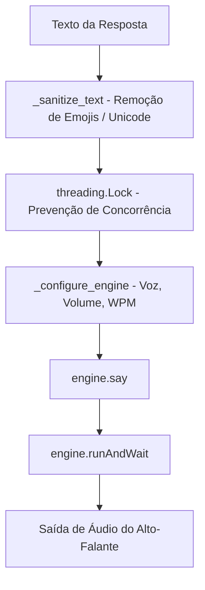

# Documentação Técnica: Motor de Síntese de Voz (`.kamila/core/tts_engine.py`)

Esta documentação descreve em detalhes o funcionamento do módulo **`tts_engine.py`**, representado pela classe `TTSEngine`. Este componente é responsável pelo **Text-to-Speech (TTS)** da assistente **Kamila**, convertendo respostas de texto em síntese de voz audível através da biblioteca **pyttsx3**.

---

## 1. Visão Geral da Arquitetura

O `TTSEngine` adota um padrão de reutilização de instância e bloqueio de threads (`threading.Lock`), garantindo que chamadas consecutivas ou concorrentes de fala não causem conflitos nos drivers de áudio do sistema operacional Windows (SAPI5).



---

## 2. Configurações de Voz e Variáveis de Ambiente

As propriedades de síntese podem ser ajustadas no arquivo `.env`:

| Variável | Valor Padrão | Descrição |
| :--- | :--- | :--- |
| **`VOICE_RATE`** | `180` | Velocidade da fala em Palavras Por Minuto (WPM). |
| **`VOICE_VOLUME`** | `0.9` | Volume do áudio sintetizado (faixa de `0.0` a `1.0`). |
| **`Voz`** | Detecção Automática | Seleciona o ID da voz do sistema que contenha `"brazil"` ou `"pt-br"`. |

---

## 3. Detalhamento dos Métodos da Classe `TTSEngine`

### 3.1 Construtor (`__init__`)
- Instancia o motor nativo `pyttsx3.init()`.
- Inicializa o objeto de trava `self._lock = threading.Lock()`.
- Busca a voz em português via `_get_portuguese_voice_id()`.
- Define taxa de velocidade e volume inicial.

---

### 3.2 Seleção de Voz em Português (`_get_portuguese_voice_id`)
```python
def _get_portuguese_voice_id(self):
```
- Itera pelas vozes instaladas no sistema operacional (`engine.getProperty('voices')`).
- Valida se o atributo `voice.name` ou `voice.id` contém os identificadores `"brazil"` ou `"pt-br"`.
- Se nenhuma voz for localizada, loga um aviso e utiliza a voz padrão do SO.

---

### 3.3 Higienização de Texto (`_sanitize_text`)
```python
def _sanitize_text(self, text: str) -> str:
```
- **Objetivo**: Evita erros críticos e exceções nos drivers de síntese de voz provocados por caracteres não pronunciáveis.
- **Remoção de Emojis**: Utiliza uma expressão regular Unicode para filtrar:
  - Emoticons (`\U0001F600-\U0001F64F`).
  - Símbolos & Pictogramas (`\U0001F300-\U0001F5FF`).
  - Bandeiras & Transportes (`\U0001F1E0-\U0001F1FF`).
  - Dingbats & Símbolos Diversos (`\u2600-\u27BF`).

---

### 3.4 Síntese Síncrona Segura (`speak`)
```python
def speak(self, text: str):
```
- **Fluxo**:
  1. Sanitiza a mensagem (`_sanitize_text`).
  2. Adquire a trava de sincronização (`with self._lock:`).
  3. Aplica as propriedades do motor (`_configure_engine()`).
  4. Adiciona a frase à fila do sintetizador (`self.engine.say(sanitized_text)`).
  5. Bloqueia a thread atual até a conclusão da fala (`self.engine.runAndWait()`).
- **Tratamento de Erros**: Captura exceções de `RuntimeError` caso o loop de eventos já esteja ativo.

---

### 3.5 Síntese Assíncrona (`speak_async`)
```python
def speak_async(self, text: str):
```
- Dispara uma nova thread (`threading.Thread`) com uma instância dedicada do motor `pyttsx3`, permitindo que a aplicação continue executando outras tarefas enquanto o áudio é sintetizado em segundo plano.

---

### 3.6 Encerrando Recursos (`cleanup`)
- Executa `self.engine.stop()` de forma segura dentro do bloco de lock para parar qualquer fala pendente.
