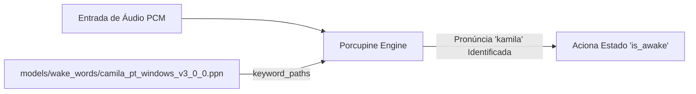

# Documentação Técnica: Diretório de Palavras de Ativação (`models/wake_words/`)

Esta documentação descreve a função, os arquivos e as especificações do diretório **`models/wake_words/`**, localizado em `models/wake_words/`. Este diretório armazena os **binários de acionamento customizados (*Wake Words*)** compilados pela Picovoice Console para a assistente **Kamila**.

---

## 1. Visão Geral

O diretório `models/wake_words/` armazena os arquivos de extensão `.ppn` (*Picovoice Porcupine Keyword Model*). Estes arquivos contêm as representações treinadas especificamente para reconhecer a pronúncia do nome da assistente.



---

## 2. Conteúdo e Ficha Técnica

### `models/wake_words/camila_pt_windows_v3_0_0.ppn`

| Parâmetro | Detalhe |
| :--- | :--- |
| **Caminho Relativo** | `models/wake_words/camila_pt_windows_v3_0_0.ppn` |
| **Formato de Arquivo** | Binário de Palavra-Chave Porcupine (`.ppn`) |
| **Tamanho em Disco** | `2.744 bytes` (~2.7 KB) |
| **Palavra-Chave Mapeada** | `"camila"` / `"kamila"` |
| **Idioma do Modelo** | Português (`pt-BR`) |
| **Sistema Operacional Target**| Windows (`x86_64`) |
| **Versão da Engine** | Porcupine v3.0.0 |

---

## 3. Função no Ciclo de Vida da Assistente

1. **Acionamento sem Mão (Hands-Free)**: Permite que o usuário ative a assistente pronunciando *"Kamila"* a qualquer momento, sem pressionar botões ou clicar no mouse.
2. **Filtragem de Falsos Positivos**: Treinado com algoritmo de discriminação avançada para evitar ativamento acidental por palavras foneticamente semelhantes (ex: *"câmera"*, *"camisa"*, *"família"*).
3. **Inicialização no Código**:
   ```python
   self.porcupine = pvporcupine.create(
       access_key=PICOVOICE_API_KEY,
       keyword_paths=['models/wake_words/camila_pt_windows_v3_0_0.ppn'],
       model_path='models/porcupine_models/porcupine_params_pt.pv'
   )
   ```
