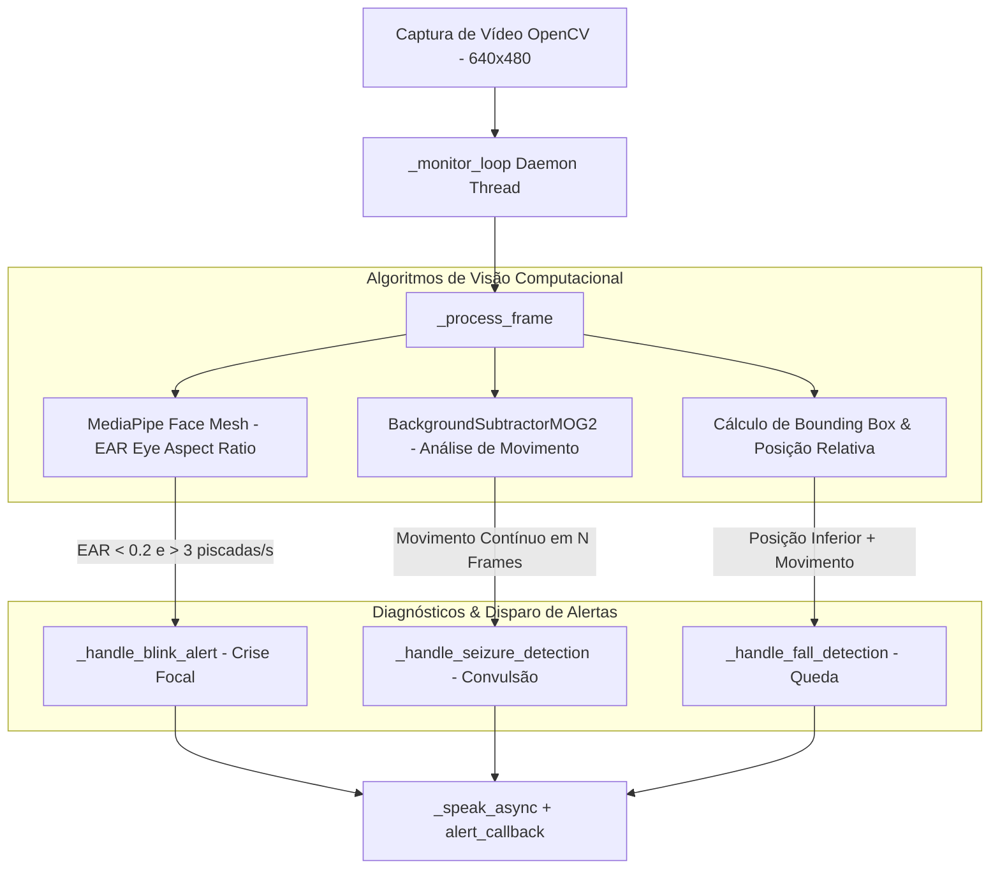

# Documentação Técnica: Monitoramento Clínico por Webcam (`.kamila/core/webcam_monitor.py`)

Esta documentação descreve em detalhes o funcionamento do módulo **`webcam_monitor.py`**, representado pela classe `WebcamMonitor`. Este componente é responsável pela **vigilância por visão computacional da assistente Kamila**, utilizando **OpenCV** e **MediaPipe Face Mesh** para a detecção precoce de emergências médicas como quedas, convulsões motores e episódios de crises oculares focais.

---

## 1. Visão Geral da Arquitetura

O `WebcamMonitor` processa o fluxo de vídeo da webcam em tempo real em uma thread separada (*daemon thread*). Ele combina algoritmos de subtração de fundo (MOG2) com malha de pontos faciais (Face Mesh) para reconhecer anomalias físicas e comportamentais sem bloquear a interface de voz ou texto.

---

## 2. Indicadores de Emergência e Fórmulas

### 2.1 Detecção de Piscadas e Crises Focais (EAR - Eye Aspect Ratio)
Utilizando o MediaPipe Face Mesh, o sistema calcula a abertura dos olhos através das distâncias euclidianas dos pontos verticais e horizontais da pálpebra:

$$\text{EAR} = \frac{||p_2 - p_6|| + ||p_3 - p_5||}{2 \cdot ||p_1 - p_4||}$$

- **Critério de Olho Fechado**: $\text{EAR} < 0.2$.
- **Alerta de Anormalidade**: Acima de 3 piscadas completas por segundo (`blink_limit = 3`).

---

### 2.2 Detecção de Convulsões e Tremor Motor
- Utiliza a máscara em primeiro plano devolvida por `cv2.createBackgroundSubtractorMOG2`.
- Avalia a área total de movimento contínuo ao longo de múltiplos quadros consecutivos (`consecutive_motion >= consecutive_frames * 2`).

---

### 2.3 Detecção de Quedas
- Extrai os contornos da silhueta do usuário.
- Verifica a altura relativa do retângulo delimitador em relação à tela:
  $$\text{Altura Relativa} = \frac{y + h}{\text{Altura do Frame}}$$
- **Critério de Queda**: $\text{Altura Relativa} > (1 - \text{fall\_threshold})$ associado a movimento.

---

## 3. Modo de Saúde Intensivo (`set_health_mode`)

O sistema suporta ajuste dinâmico de sensibilidade dependendo do estado do usuário:

| Parâmetro | Modo Normal | Modo Saúde Intensivo | Descrição |
| :--- | :--- | :--- | :--- |
| **`motion_threshold`** | `1000` | `500` | Sensibilidade à área de movimento. |
| **`fall_threshold`** | `0.3` | `0.2` | Tolerância à altura para detecção de queda. |
| **`alert_cooldown`** | `30s` | `15s` | Intervalo mínimo entre alertas repetidos. |

---

## 4. Detalhamento dos Métodos Principais

### 4.1 `start_monitoring(alert_callback=None) -> bool`
- Abre o dispositivo de captura no índice `0` (`cv2.VideoCapture(0)`).
- Define resolução estática para alta performance (640x480).
- Instancia o `cv2.createBackgroundSubtractorMOG2(history=100, varThreshold=50, detectShadows=True)`.
- Dispara a thread `_monitor_loop`.

---

### 4.2 `_process_frame(frame)`
- Redimensiona e converte o frame para os formatos RGB (MediaPipe) e Grayscale/GaussianBlur (OpenCV).
- Aplica dilatação morfológica (`cv2.dilate`) na máscara de movimento.
- Insere marcadores de HUD visual na tela (`_draw_detection_info`) para indicar status: `"MONITORANDO"`, `"MOVIMENTO!"`, `"QUEDA!"`, `"OLHO FECHADO"`.

---

### 4.3 `stop_monitoring()` e `cleanup()`
- Interrompe o loop booleano `is_monitoring`.
- Aguarda a conclusão da thread (`join(timeout=2)`).
- Libera o hardware da câmera (`cap.release()`) e encerra o pipeline do MediaPipe Face Mesh (`face_mesh.close()`).
